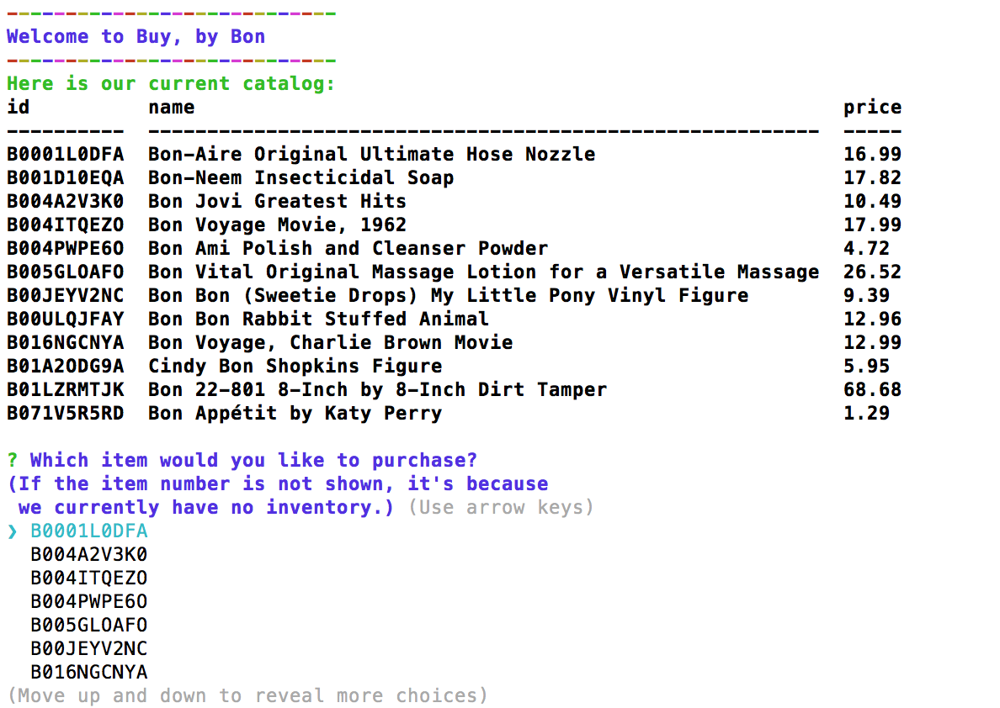
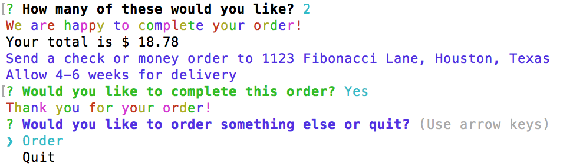
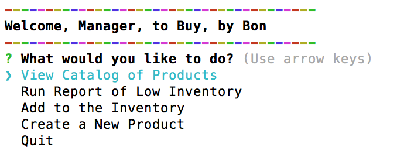
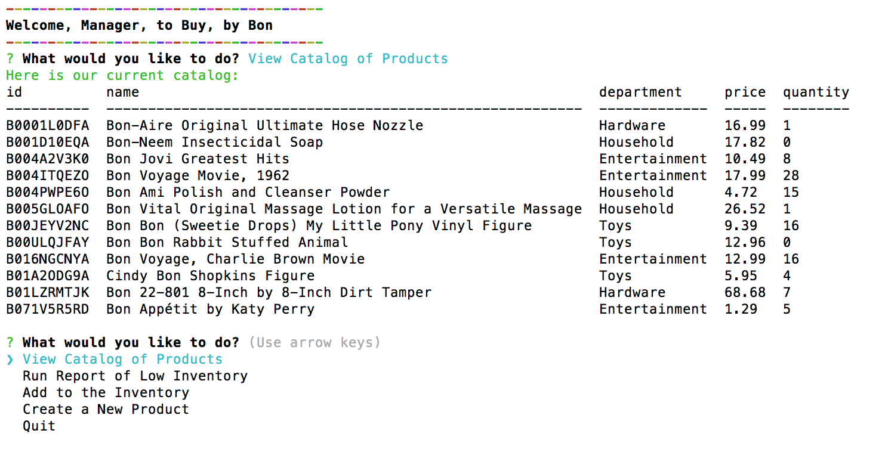
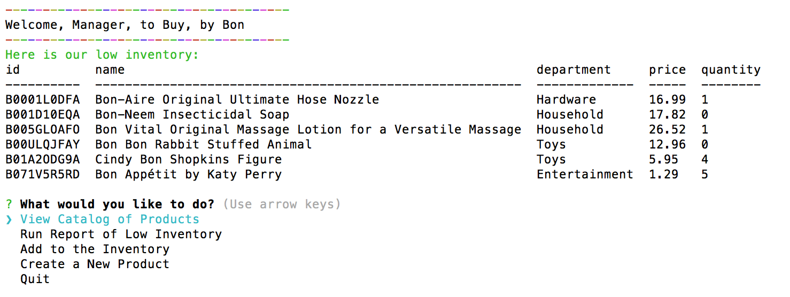
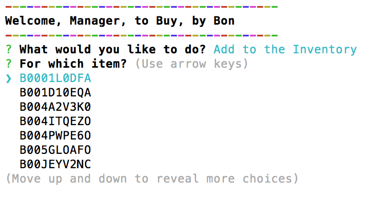
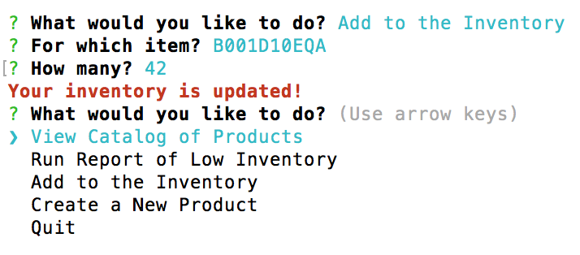
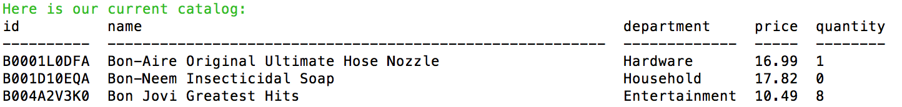
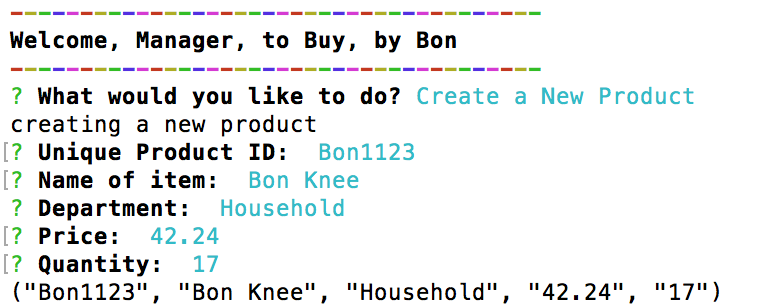

# Buy, by Bon

*Buy, by Bon* is a Node.js and SQL command line app with an Amazon-like storefront and separate customer, manager and executive facing applications. The app uses a database of products and takes in orders from customers, which depletes stock from the store's inventory. Managers and executives can add more products to different departments and track profit.

 You can find the source files at [https://github.com/mathfour/buy-by-bon](https://github.com/mathfour/buy-by-bon)

## Dependencies

Clone this repo to your desktop and run `npm install` to install its 4 dependencies.

- [mySQL](https://www.npmjs.com/package/mysql): A node.js driver for mysql

- [Colors](https://www.npmjs.com/package/colors): Used to generate colored text in the console 

- [Inquirer](https://www.npmjs.com/package/inquirer): Used to user input

- [Console.table](https://www.npmjs.com/package/console.table): A method that prints an array of objects as a table in console
- [Clear](https://www.npmjs.com/package/clear): Allows the clearing of the console so things can look less cluttered.

## Set Up
Once you are in the *Buy, by Bon* repository/directory, run the following code in the command line to create the *Buy, by Bon* database and the *products* table: `mysql -u root -p < schema.sql`

Then use your text editor of choice to update `buy-by-bon.js` and `manager-view-bbb.js` with your mysql password, if you use one.

## Customer Use

- Run `node buy-by-bon.js` to start the customer facing *Buy, by Bon* app.

- Customers are shown the catalog and may choose a product to purchase by its ID. If a product has no inventory, it **_will_** be shown in the catalog, but **_will not_** come up as an option to purchase.

- If there isn't sufficient inventory to fulfil the order, the customer is notified.

- Customers are shown the total cost and are asked to confirm their purchase. After the purchase, the catalog is updated in the mysql database to reflect new stock quantities.

- Regardless of order status, customers are prompted to exit or attempt another purchase.

## Manager Use

- Run `node manager-view-bbb.js` to start the manager facing *Buy, by Bon* app.

- Managers are give a list of options:

#### View Catalog of Products

Like the customer app, this shows the full catalog of products - including those that are at zero inventory. Unlike the customer app, though, managers get to view department and inventory. 

#### Run Report of Low Inventory

This option lists items that are designated as "low" in inventory. Currently low is defined as 5 or fewer units in stock.

#### Add to the Inventory

A manager may add inventory to any product already in the database with this option.

The manager will be asked to choose the unique product ID and then prompted for the additional inventory to be added.

*Before*

*After*

#### Create a New Product

This option is still in development. When finished, the manager's inputs of unique ID, name of the product, price, department and quantity will be added into the database and available for purchase by customers. Right now, the app only takes in the information and parses it in the proper format to be added to the database's table.

## Next Steps
 
In addition to completing the manager app (the "Create a New Product" option), the supervisor app can be written. 

## Needed Improvements & Commentary

I completed the customer app with a serious lack of DRY. So I started the manager app with the idea that I would consolidate many of the methods into the `modules-bbb.js` file. This went well until I attempted to adjust the customer app `buy-by-bon.js` to utilize the export functions. 

I got lost in trying to figure out how much to modularize. Things seemed to be fine until I started trying to work out the variety of callbacks. You can see how messy this got by looking at the file `buy-by-bon-with-mods.js` in the `non-working-and-test-files` folder, or click [here](https://github.com/mathfour/buy-by-bon/blob/master/non-working-and-test-files/buy-by-bon-with-mods.js).

## Acknowledgements 

A big thanks to the following folks:
- [Stephanie Orpilla](https://github.com/stephorpilla) whose `README.md` helped me create this one.
- [Erick Rivas](https://github.com/charmeleon) whose patience with me regarding callback functions is approaching infinity.
- [Seth Gibson](https://github.com/sgibson53) who considers my questions quietly while I formulate my own answers before he even needs to speak.
